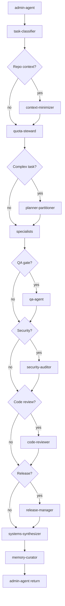

# Conditional agent pipeline

From `.agentos/agent-registry.json` — gates are optional (`?`).

## Specialist routing (tier-0)

| Signal | Primary agent |
|--------|---------------|
| answer_only | admin-agent |
| research | issue-intake-researcher |
| frontend | frontend-ui-agent |
| backend | backend-service-agent |
| database | database-migration-agent |
| integration | integration-broker |
| repo analysis | repo-cartographer |
| default code | code-implementer |

Core roster: 17 agents in registry + 4 addons. See [[flows/pipeline]].
