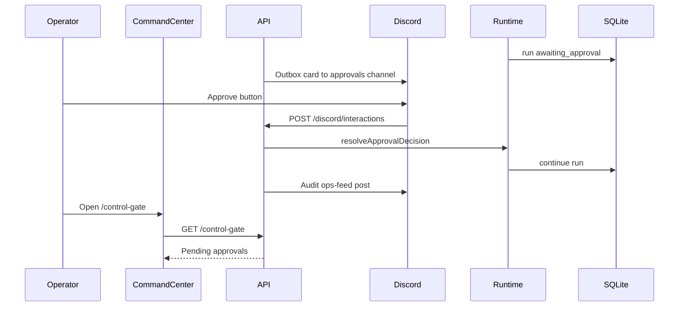

# Approval gate sequence

Human-in-the-loop when `AGENTOS_REQUIRE_HUMAN_APPROVAL=true` or release gate blocks.

```mermaid
sequenceDiagram
    participant Operator
    participant CommandCenter
    participant API
    participant Discord
    participant Runtime
    participant SQLite

    Runtime->>SQLite: run awaiting_approval
    API->>Discord: Outbox card to approvals channel
    Operator->>Discord: Approve button
    Discord->>API: POST /discord/interactions
    API->>Runtime: resolveApprovalDecision
    Runtime->>SQLite: continue run
    API->>Discord: Audit ops-feed post
    Operator->>CommandCenter: Open /control-gate
    CommandCenter->>API: GET /control-gate
    API-->>CommandCenter: Pending approvals
```

UI mirror: [[areas/apps-command-center]] Control Gate view + Forge approval cards.
