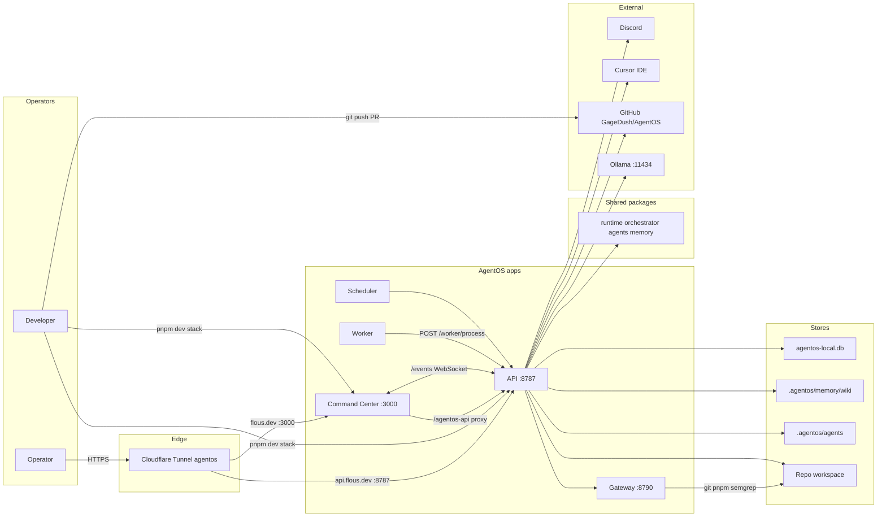

# Containers and hosting (C4 L2)

Current app processes and data stores (reviewed 2026-06-13).

## Apps (`apps/`)

| App | Port | Role |
|-----|------|------|
| [[apps/command-center]] | 3000 | Forge UI, wiki browser, chat dock |
| [[apps/api]] | 8787 | Auth, missions, Discord, wiki API, WebSocket |
| [[apps/gateway]] | 8790 | Allowlisted git/pnpm/semgrep |
| [[apps/worker]] | — | Polls and processes mission runs |
| [[apps/scheduler]] | — | Scheduled automations |

## Optional infra (env only, not required for MVP)

- Postgres `:5432`, Redis `:6379` — referenced in `.env.example`, SQLite is primary today
