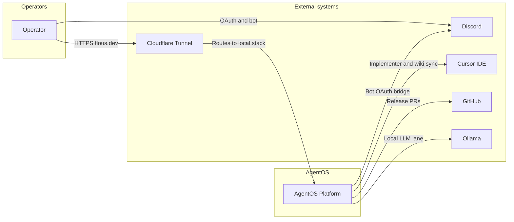

# System context (C4 L1)

Operator-facing AgentOS on `flous.dev`, local-first stack behind Cloudflare Tunnel.

## Hostnames (production)

| Host | Target |
|------|--------|
| `flous.dev` | Command Center `:3000` |
| `app.flous.dev` | Command Center alias |
| `agentos.flous.dev` | Command Center alias |
| `api.flous.dev` | API `:8787` |

See [[areas/diagrams/containers]] for services inside the boundary.
