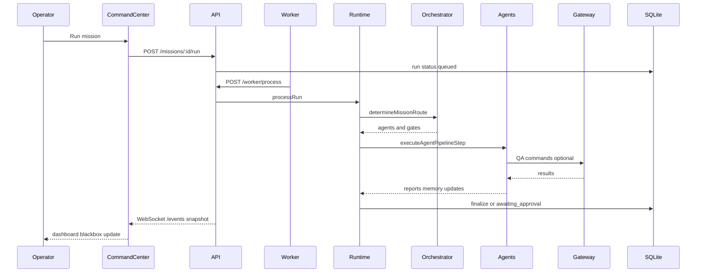

# Mission run sequence

```mermaid
sequenceDiagram
    participant Operator
    participant CommandCenter
    participant API
    participant Worker
    participant Runtime
    participant Orchestrator
    participant Agents
    participant Gateway
    participant SQLite

    Operator->>CommandCenter: Run mission
    CommandCenter->>API: POST /missions/:id/run
    API->>SQLite: run status queued
    Worker->>API: POST /worker/process
    API->>Runtime: processRun
    Runtime->>Orchestrator: determineMissionRoute
    Orchestrator-->>Runtime: agents and gates
    Runtime->>Agents: executeAgentPipelineStep
    Agents->>Gateway: QA commands optional
    Gateway-->>Agents: results
    Agents-->>Runtime: reports memory updates
    Runtime->>SQLite: finalize or awaiting_approval
    API-->>CommandCenter: WebSocket /events snapshot
    CommandCenter-->>Operator: dashboard blackbox update
```

Run statuses: `queued` → `running` → `awaiting_approval` | `paused` | `failed` | `complete`
