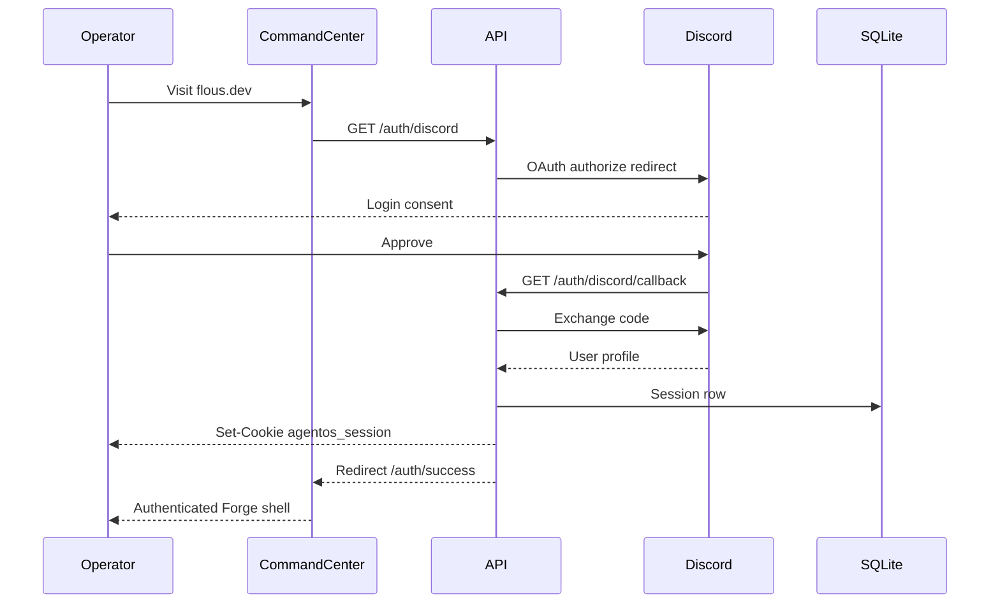

# Discord OAuth session

Production cookies use `Domain=.flous.dev` when `AGENTOS_API_BASE_URL` includes flous.dev.

Callbacks: local `127.0.0.1:8787` and prod `api.flous.dev` (register both in Discord portal).
