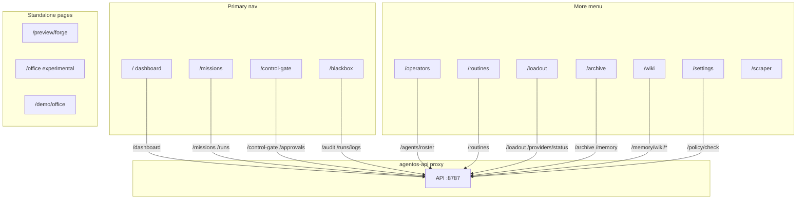

# UI routes → API proxy

Command Center sections (Forge shell). Standalone pages outside the shell listed separately.

## Section keys (`AgentOSLocalApp`)

`dashboard` · `missions` · `routines` · `operators` · `control-gate` · `blackbox` · `archive` · `wiki` · `loadout` · `settings`

Global chrome: command palette, health bar, chat FAB, run inspector, optional memory queue panel on wiki.
