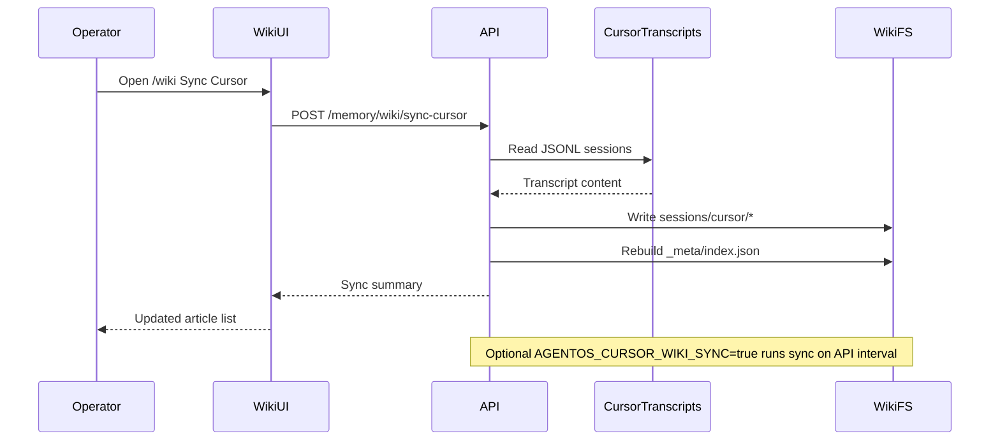

# Memory wiki sync

Sources: Cursor transcripts, ChatGPT planning exports, repo index, agent curator, manual briefs.

Other ingest: `pnpm wiki:index-repo`, `pnpm wiki:sync-chatgpt`, memory-curator on run complete → [[flows/memory-curator]].
