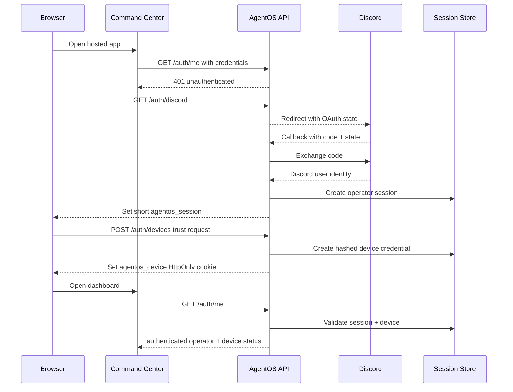

# Trusted Device Auth Wireframe

## Purpose

AgentOS needs a hosted login flow that remembers trusted operator devices without leaving the Command Center broadly exposed. The flow keeps Discord OAuth as identity proof, then issues a revocable server-side device credential for the browser.

This is a static planning wireframe for the Command Center and API auth work.

## Product Shape

- Outer wall: Cloudflare Access, Tailscale, or equivalent network gate before AgentOS is publicly reachable.
- Identity: Discord OAuth remains the operator login provider.
- Device trust: AgentOS issues an opaque `agentos_device` credential after login and stores only a hash server-side.
- Session: short-lived `agentos_session` access cookie refreshed from a valid trusted device.
- Step-up: approvals, tool execution, secrets, deploys, and release gates require a fresh trusted-device check.
- Revocation: operators can list, rename, expire, and revoke devices.

## Screen 1: Signed-Out Gate

```text
+------------------------------------------------------------------+
| AgentOS Command Center                              flous.dev     |
+------------------------------------------------------------------+
|                                                                  |
|  OPERATOR ACCESS                                                 |
|                                                                  |
|  Sign in to reach missions, approvals, memory, and agent control. |
|                                                                  |
|  +------------------------------------------------------------+  |
|  | Continue with Discord                                      |  |
|  +------------------------------------------------------------+  |
|                                                                  |
|  Status                                                         |
|  - Network gate: passed / required                              |
|  - API session: missing                                         |
|  - Device trust: unknown                                        |
|                                                                  |
|  Small text: Only approved operators can access hosted AgentOS.  |
|                                                                  |
+------------------------------------------------------------------+
```

Expected behavior:

- `/auth/me` returns `401` with `authenticated: false`.
- CTA links to `/auth/discord`.
- If the API is unreachable, show the existing local/offline state instead of a blank login card.

## Screen 2: First Login Device Prompt

```text
+------------------------------------------------------------------+
| AgentOS Command Center                              Auth complete |
+------------------------------------------------------------------+
|                                                                  |
|  TRUST THIS DEVICE?                                              |
|                                                                  |
|  Signed in as GageDush via Discord.                              |
|                                                                  |
|  Device label                                                    |
|  +------------------------------------------------------------+  |
|  | Gage's Windows desktop                                     |  |
|  +------------------------------------------------------------+  |
|                                                                  |
|  Trust duration                                                  |
|  [ 30 days ] [ 90 days ] [ This session only ]                  |
|                                                                  |
|  +------------------------+   +-------------------------------+  |
|  | Trust device           |   | Continue once                  |  |
|  +------------------------+   +-------------------------------+  |
|                                                                  |
|  Risk note                                                       |
|  This creates a revocable device key stored as an HttpOnly cookie.|
|                                                                  |
+------------------------------------------------------------------+
```

Expected behavior:

- Discord OAuth creates an operator identity session.
- Choosing `Trust device` creates a server-side device record and an opaque cookie.
- Choosing `Continue once` creates only the short access session.
- Device label defaults from user agent, but remains editable.

## Screen 3: Command Center Signed-In Header

```text
+------------------------------------------------------------------+
| AgentOS Command Center     Missions  Control Gate  Memory  Devices|
+------------------------------------------------------------------+
| Signed in: GageDush              Device: Windows desktop - trusted|
| Session: fresh                   Step-up: not required            |
+------------------------------------------------------------------+
|                                                                  |
|  Mission Control                                                  |
|  +-------------------+ +-------------------+ +------------------+ |
|  | Pending approvals| | Active sessions   | | Tool execution   | |
|  | 3                | | 2                 | | gated            | |
|  +-------------------+ +-------------------+ +------------------+ |
|                                                                  |
|  Control Gate actions use the signed-in operator id instead of    |
|  falling back to `operator-local`.                                |
|                                                                  |
+------------------------------------------------------------------+
```

Expected behavior:

- Auth state is visible but compact.
- Operator actions use the authenticated `operatorId`.
- If the device is not trusted, sensitive actions show the step-up prompt.

## Screen 4: Step-Up Prompt

```text
+------------------------------------------------------------------+
| Control Gate                                          Step-up     |
+------------------------------------------------------------------+
|                                                                  |
|  CONFIRM OPERATOR DEVICE                                         |
|                                                                  |
|  Action: Approve tool execution for mission `release-gate-42`     |
|  Risk: filesystem + shell command                                |
|                                                                  |
|  Your login is valid, but this action requires a trusted device   |
|  checked within the last 15 minutes.                              |
|                                                                  |
|  +------------------------+   +-------------------------------+  |
|  | Confirm with passkey   |   | Re-auth with Discord          |  |
|  +------------------------+   +-------------------------------+  |
|                                                                  |
|  +------------------------------------------------------------+  |
|  | Deny action                                                |  |
|  +------------------------------------------------------------+  |
|                                                                  |
+------------------------------------------------------------------+
```

Expected behavior:

- The approval remains pending until step-up succeeds.
- Passkey is the preferred future path; Discord re-auth is acceptable for the first implementation.
- Success writes an audit event with `operatorId`, `deviceId`, action id, and time.

## Screen 5: Trusted Devices Panel

```text
+------------------------------------------------------------------+
| Devices                                             Signed in     |
+------------------------------------------------------------------+
|                                                                  |
|  Trusted devices                                                 |
|                                                                  |
|  +----------------------+------------+-------------+------------+|
|  | Device               | Last seen  | Trust       | Action     ||
|  +----------------------+------------+-------------+------------+|
|  | Windows desktop      | Now        | 90 days     | Revoke     ||
|  | Laptop Chrome        | Yesterday  | 30 days     | Revoke     ||
|  | Phone Safari         | 12d ago    | Expired     | Remove     ||
|  +----------------------+------------+-------------+------------+|
|                                                                  |
|  Device detail drawer                                            |
|  - Label                                                         |
|  - Created at                                                    |
|  - Last seen                                                     |
|  - Approximate client/browser                                    |
|  - Revoke all sessions for this device                           |
|                                                                  |
+------------------------------------------------------------------+
```

Expected behavior:

- Device records are operator-scoped.
- Revocation clears refresh capability immediately.
- The current device is visually marked so the operator does not revoke it by accident.

## Screen 6: Expired Or Revoked Device

```text
+------------------------------------------------------------------+
| AgentOS Command Center                              Session reset |
+------------------------------------------------------------------+
|                                                                  |
|  DEVICE TRUST EXPIRED                                            |
|                                                                  |
|  Your browser still has an AgentOS cookie, but the server-side    |
|  device record is expired or revoked.                             |
|                                                                  |
|  +------------------------+   +-------------------------------+  |
|  | Sign in again          |   | Continue read-only             |  |
|  +------------------------+   +-------------------------------+  |
|                                                                  |
|  Read-only mode can show public health and non-sensitive status.  |
|                                                                  |
+------------------------------------------------------------------+
```

Expected behavior:

- Expired device tokens do not silently create new trust.
- Read-only mode must not expose missions, approvals, memory, secrets, or tool output.

## Route Guard Matrix

| Surface | Requirement | Notes |
| --- | --- | --- |
| `/health` | Public | No cookies required. |
| `/auth/*` | Public | OAuth and logout routes. |
| `/media/*` | Public or signed URL | Agent images can remain public if no sensitive data is embedded. |
| `/auth/me` | Optional session | Returns auth state. |
| `/missions`, `/sessions`, `/chat`, `/wiki` | Operator session | Reject if no valid session. |
| `/approvals/*` | Trusted device | No `operator-local` fallback for hosted mode. |
| `/tools/*`, `/release/*`, `/discord/*`, `/scraper/*` | Trusted device + step-up for risky actions | Audit every decision. |
| Secret/config routes | Fresh step-up | Prefer no browser readback of secret values. |

## Auth Flow



## Server-Side Records

```text
operator_sessions
- id
- operator_id
- provider
- provider_user_id
- issued_at
- expires_at
- revoked_at
- last_seen_at

operator_devices
- id
- operator_id
- label
- token_hash
- created_at
- last_seen_at
- trusted_until
- revoked_at
- user_agent_hash
- ip_hash
- step_up_at
- session_version
```

Cookie proposal:

- `agentos_session`: short access token, HttpOnly, Secure, SameSite=None for cross-subdomain hosted mode.
- `agentos_device`: opaque refresh/device token, HttpOnly, Secure, SameSite=None, rotated on successful refresh.
- CSRF token: non-HttpOnly double-submit or server-issued action token for POST/PUT/DELETE.

## Implementation Notes

- Add `AGENTOS_AUTH_REQUIRED=true` for hosted mode while keeping mock/local behavior available in development.
- Replace hosted write-route fallbacks like `operator-local` with `requireOperatorSession()`.
- Tighten API CORS from reflected origins to an allowlist such as `https://flous.dev`, `https://app.flous.dev`, and local dev URLs.
- Add audit events for login, device trust, device revoke, failed step-up, successful step-up, and sensitive route denial.
- Keep the first pass simple: Discord OAuth + trusted device cookies. Add WebAuthn/passkeys as the stronger second factor after the route guards are in place.
